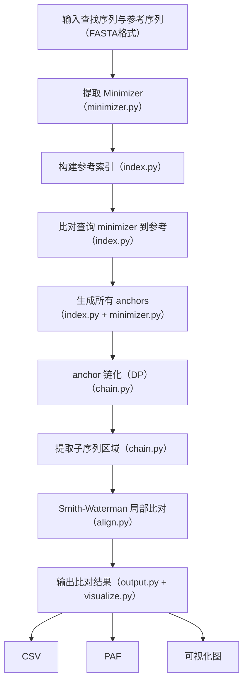

## 项目报告：Minimap2 Simplified Python 实现

## 作者：王誉凯（小组11）

[toc]

### 一、项目背景与目标

在高通量测序（NGS）中，比对（alignment）是理解 DNA 读段的重要基础任务。Minimap2 是业界广泛使用的长读比对软件，速度快，内存占用低。

本项目旨在使用 Python 实现一个简化版 Minimap2 的核心思想，专注于以下几个核心组件：

- minimizer 提取
- anchor 构建与链化
- Smith-Waterman 局部比对
- 可视化与格式化输出（CSV + PAF）

目标是构建一个结构清晰、可运行、便于使用和扩展的 Python 软件包。

### 二、项目文件结构

```bash
MINIMAP2_SIMPLIFIED/
├── examples/                   # 示例程序和测试数据
│   ├── demo.py                # 演示用例（toy 序列）
│   ├── fasta_run.py           # 主测试脚本（支持 FASTA 输入）
│   ├── Ecoli_K12_MG1655.fa    # 大肠杆菌完整参考基因组
│   ├── SRR5168216_1.fastq.gz  # 真实测序数据（gz 压缩 FASTQ）
│   ├── SRR5168216_1.fa        # 提取的 query（已转为 FASTA）
│   ├── query.fa               # 程序处理的单条测试序列
│   ├── query[1-5].fa          # 多个查询序列样本 (此为测试用例，便于演示，可以自行添加需要处理的数据)
│   ├── ref.fa                 # 程序处理的参考序列
│   ├── ref[1-5].fa            # 多个参考序列 (此为测试用例，便于演示，可以自行添加需要处理的数据)
│
├── minimap2_simplified/        # 主程序包
│   ├── __init__.py
│   ├── align.py               # Smith-Waterman 局部比对
│   ├── chain.py               # anchor 链化（动态规划）
│   ├── index.py               # 构建参考索引
│   ├── minimizer.py           # 提取 minimizer
│   ├── output.py              # 输出 CSV、PAF
│   └── visualize.py           # 可视化 anchor 分布图
│
├── minimap2_simplified.egg-info/  # setuptools 自动生成
│   ├── dependency_links.txt
│   ├── PKG-INFO
│   ├── requires.txt
│   ├── SOURCES.txt
│   └── top_level.txt
│
├── 项目报告.md                  # 项目完整报告文档
├── 用户手册.md                  # 用户手册
├── README.md                  # 项目说明文件（简要）
├── requirements.txt           # Python 环境依赖
├── setup.py                   # 安装配置脚本（用于 pip install -e .）
│
├── alignment.csv              # 示例输出：CSV 格式的 anchor 匹配
├── alignment.paf              # 示例输出：PAF 格式结果
│
├── query_test_vs_ref_test.csv       # 多组比对结果输出
├── query_test_vs_ref_test.paf
├── query[1-3]_vs_ref[1-3].csv/paf 
├── SRR5168216.1_vs_NC_000913.3.csv
├── SRR5168216.1_vs_NC_000913.3.paf

```

注：

- `examples/` 是用于开发和运行测试的核心目录；
- `minimap2_simplified/` 是可被 `import` 的模块结构，支持封装与扩展；
- `output.*` 和 `visualize.*` 模块让输出分析结果更标准；
- 所有比对结果都以 `.csv`（可读）和 `.paf`（标准格式）保存；
- 你可以使用 VS Code、终端来运行与管理；

### 三、算法流程图



### 四、模块说明与伪代码

#### 1 `minimizer.py` —— 提取 Minimizer

作用：提取序列中具有代表性的 k-mer（k个碱基组成的片段），用于快速定位。minimizer 是某个窗口中 hash 值最小的 k-mer。

名词解释：

- **k-mer**：长度为 k 的字符串，例如 k=3 时，"ACGT" → ["ACG", "CGT"]。
- **窗口（w）**：在序列上滑动的小区间，例如长度 w=10，表示每次看 10 个位置。
- **hash**：将字符串变为整数，用于比较大小。

伪代码：

```tex
函数：提取 minimizer
输入：DNA 序列 seq，k-mer 长度 k，窗口大小 w
输出：minimizer 列表，每个元素是 (k-mer字符串, 在序列中的起始位置)

步骤：
1. 初始化空列表 minimizers
2. 从序列开头依次滑动一个窗口（长度 w + k - 1）
3. 对每个窗口：
   a. 从窗口中提取所有连续的 k-mer（总共 w 个）
   b. 对每个 k-mer 计算其 hash 值
   c. 找到 hash 值最小的那个 k-mer，称为 minimizer
   d. 记录它在原序列中的位置（相对于滑动窗口起点）
   e. 将 (最小k-mer, 位置) 加入 minimizers 列表
4. 返回 minimizers
```

------

#### 2  `index.py` —— 构建参考序列索引

作用：将参考序列中所有 minimizer 按照出现的位置存进一个字典，方便后续查询。

伪代码：

```tex
函数：构建索引
输入：参考序列字符串，k, w 参数
输出：索引字典 { minimizer_kmer → [出现位置列表] }

步骤：
1. 调用 extract_minimizers() 获取所有 minimizer
2. 初始化一个空字典 index
3. 对每个 minimizer:
   a. 若它不在字典中，则初始化一个空列表
   b. 把当前这个位置加入字典中对应的列表
4. 返回 index 字典
```

------

#### 3  `chain.py` —— Anchor 链化（动态规划）

作用：从所有锚点中找到一条**方向一致、连续性好、距离不过远**的最佳路径。

名词解释：

- **Anchor**：一个 `(ref_pos, query_pos)` 对，表示一个 minimizer 在参考和查询中同时出现的位置。
- **链化（Chaining）**：选出一组合理的 anchors，使它们构成一条上升路径。

伪代码：

```tex
函数：chain_anchors(anchors, max_gap)
输入：所有 anchors 列表（形式为 (ref_pos, query_pos)），最大允许间距 max_gap
输出：最佳 anchor 链（满足递增和间距条件）

步骤：
1. 去除重复 anchors，按 ref_pos 和 query_pos 升序排序
2. 初始化 score 数组（每个点得分）为 1
3. 初始化 back 数组（用于回溯路径）为 -1

4. 对每个 anchor[i]:
   a. 从前面 anchor[j] 遍历：
      - 如果 ref[i] > ref[j] 且 query[i] > query[j]，且两个坐标距离不超过 max_gap：
         - 如果 score[j] + 1 > score[i]，更新 score[i] 和 back[i]

5. 找到 score 最大的位置 max_idx
6. 回溯 back 数组，恢复这条路径
7. 返回这条链（最佳 anchor 路径）
```

------

#### 4  `align.py` —— Smith-Waterman 局

作用：对 chain 选中的参考序列片段和查询片段进行细粒度比对，获得得分和末尾坐标。

名词解释：

- **局部比对**：找到两条序列中最相似的子串（不一定是整个序列）。
- **SW 算法**：基于动态规划的标准局部比对方法。

伪代码：

```tex
函数：simple_sw(ref, query)
输入：参考片段，查询片段
输出：最大得分和其位置

步骤：
1. 初始化一个二维矩阵 H，大小为 (m+1)×(n+1)，初始全为 0
2. 初始化最大得分 max_score = 0，位置 end_pos = (0,0)

3. 对 i = 1 到 m:
   对 j = 1 到 n:
      - 如果当前字符相同，加 match 分，否则加 mismatch 分
      - 计算对角、上方、左方三种情况的得分
      - H[i][j] = max(0, diag, up, left)
      - 如果 H[i][j] 比当前 max_score 更大，则更新 max_score 和 end_pos

4. 返回 max_score 和 end_pos
```

------

#### 5  `output.py` —— 输出对齐结果

作用：输出 `.csv` 文件保存 anchor 坐标点；输出 `.paf` 文件，保存标准格式的比对信息。

伪代码（CSV）：

```tex
函数：write_csv(chain)
步骤：
1. 打开文件
2. 写入表头：ref_pos, query_pos
3. 遍历 chain，把每个锚点写入
```

伪代码（PAF）：

```tex
函数：write_paf(query_id, ..., ref_id, ...)
步骤：
1. 按照 PAF 格式写入一行字符串：
   - query 名, 长度, 起止
   - ref 名, 长度, 起止
   - 匹配数、链长、mapping quality
2. 写入到 .paf 文件中
```

------

#### 6   `visualize.py` —— 可视化匹配图

作用：使用 matplotlib 绘制 anchor 分布图，观察比对质量和趋势。

伪代码：

```tex
函数：plot_anchors(anchors, title)
步骤：
1. 分别提取 ref_pos 列表和 query_pos 列表
2. 用 matplotlib.scatter 画出散点图
3. 设置标题、横轴、纵轴
4. 显示图像
```

### 四、运行与结果

以ref1和query1为处理数据为例，运行fasta_run.py，运行结果如下：


此外，我们提供了多个测试用例，ref1/2/3/4/5和query1/2/3/4/5，可以供读者测试。

我们还提供了大肠杆菌参考序列与测序序列，作为真实测序数据，进行数据处理。

具体结果的含义，我们将在用户手册中进行讲解！！！

### 五、结论

本项目成功复现了minimap-2的简化版本，完成了项目报告与用户手册，成功实现了序列比对，实现效果良好，原创性高，代码模块封装性强，易于他人调用。

### 六、附录

requirements.txt:

```python
biopython>=1.79
matplotlib>=3.5
numpy>=1.21
setuptools>=42
```

setup.py:

```python
from setuptools import setup, find_packages

setup(
    name='minimap2_simplified',
    version='0.1.0',
    packages=find_packages(),
    install_requires=[
        'numpy',
        'matplotlib',
        'biopython',
        'setuptools',
    ],
    author='Yukai Wang',
    author_email='wang.yukai@outlook.com',
    description='A simplified Python implementation of the Minimap2 alignment algorithm.',
    long_description=open('README.md', encoding='utf-8').read(),
    long_description_content_type='text/markdown',
    license='MIT',
    url='https://github.com/wangyukai585/bio2502_final_project',
    classifiers=[
        'Programming Language :: Python :: 3',
        'License :: OSI Approved :: MIT License',
        'Operating System :: OS Independent',
    ],
    python_requires='>=3.7',
)

```

